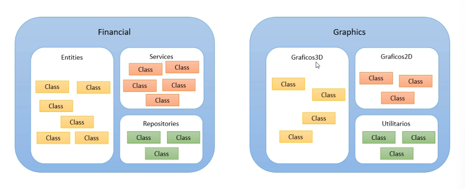

<h1 align="center" style="color: #00ff00">Estrutura de uma aplicação .NET</h1>

Uma aplicação construída em uma linguagem orientada à objetos é composta por classes. Sendo assim, vai existir um conjunto de classes para representar a aplicação. 

Essas classes podem ser agrupadas em namespaces. Um namespace é um agrupamento lógico de classes relacionadas.

> Exemplo

*Em uma aplicação eu posso ter classes que vão representar entidades de negócio como cliente, pedido, produto e etc. Essas classes podem ser agrupadas em um namespace chamado **Entities** da mesma  forma, é possível ter classes que se referem a serviços e agrupa-lás em um namespace chamado **Services**.

Além do namespace vamos ter o assembly que é um build e corresponde a um .DLL ou .EXE da aplicação, ele é um agrupamento físico de classes relacionadas. Funciona como se fosse um conjunto de subprojetos e cada um dos subprojetos possui com conjunto de namespaces com suas sub classes.

Por fim temos a aplicação ou solução que basicamente se refere ao agrupamento de assemblies relacionados.

> Exemplo

Um sistema de comércio eletrônico é uma aplicação ou solução pois a partir dela vão existir vários assemblies e cada assembly pode possui um ou vários namespaces com uma ou mais classses.

No final das contas, uma aplicação é uma solução e um assembly é um project no Visual Studio, ferramenta que nós vamos utilizar.
