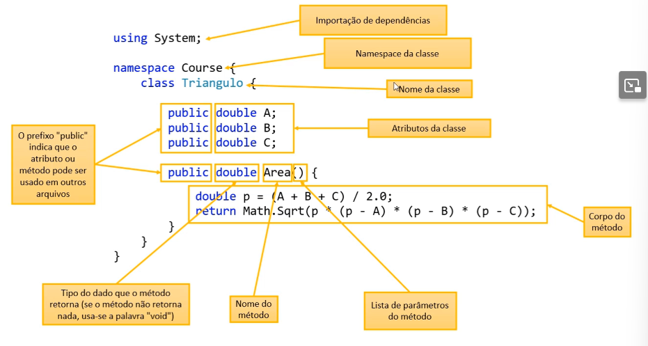

<div><h1 align="center" style="color: #00ff00">Introdução</h1></div>

Orientação a objetos é basicamente um paradigma de programação, ou seja, uma forma de resolver problemas. Dessa forma, para introdução desse tópico vamos começar comparando uma solução sem OO e com OO. 

> **Problema**

Fazer um programapara ler as medidas dos lados de dois triângulos X e Y (suponha medidas válidas). Em seguida mostrar o valor das áreas dos dois triângulos e dizer qual dos dois triângulos possui a maior área. A fórmula para calcular á area de um triângulo a partir das medidas de seus lados a, b e c é a seguinte (fórmula de Heron)

> **Fórmula**

<div align="center"></div>

Em OO podemos criar uma classe que representa o triângulo que é uma entidade com três atriutos: a, b e c. 


<div><h1 align="center" style="color: #00ff00">Classes e Atributos</h1></div>

-  É um tipo estruturado que pode conter (membros);

	-  Atributos (dados/campos)
	-  Métodos (funções/operações)

-  A classe também pode prover muitos outros recursos, tais como:

	-  Construtores
	-  Sobrecarga
	-  Encapsulamento
	-  Herança 
	-  Polimorfismo

-  Exemplos:

	-  Entidades: Produto, Cliente, Triângulo
	-  Serviços: ProdutoService, ClienteService, EmailService, StorageService
	-  Controladores: ProdutoController, ClienteController
	-  Utilitários: Calculadora, Compactador
	-  Outros (views, repositórios, gerenciadores, etc.)


Em classes, atributos public podem ser acessados em outros arquivos fora do arquivo que a classe está definida.

Quando for feita a instanciação de uma variável de uma classe, é necessário usar o comando 
"**new**" que basicamente aloca um espaço de memória do tamanho da classe que você está usando, que no nosso exemplo é a classe do triângulo.

**heap** - área de alocação dinâmica da memória.

> *Exemplo - Criação de classe Triangle*

```c#
namespace CoursePt1{
    public class Triangle {
        public double A, B, C;
    }
}
// O public nos atributos permite que eles sejam acessados por outro arquivo
```


<div><h1 align="center" style="color: #00ff00">Métodos</h1></div>

Agora que já entendemos o que são classes e atributos vamos adiante estudar as funções de classes, os métodos.

No mesmo exercício que fizemos da classe de triângulos, vamos criar métodos para obtermos os benefícios de reaproveitamento e delegação.

> *Exemplo - Método da Área*

```c#
namespace CoursePt1{
    class Triangle {
        public double A, B, C;
        public double Area(){
            double p = (A + B + C) / 2.0;
        }
    }
}
// O public nos atributos permite que eles sejam acessados por outro arquivo
```

Nesse caso, não precisamos indicar qual vai ser o triângulo que vai ter o lado A, B ou C porque estamos pegando esses valores já diretamente da instância.

```c#
namespace CoursePt1{
    class Triangle {
        public double A, B, C;
        public double Area(){
            double p = (A + B + C) / 2.0;
            return Math.Sqrt(p * (p-A) * (p-B) * (p-C));
        }
    }
}
```


> **Resumo da estrutura da classe do Triângulo**

<div align="center"></div>

<div><h1 align="center" style="color: #00ff00">Object e ToString</h1></div>

No exercício que fizemos sobre produtos não criamos nenhum método para fazer um print da saída do produto mostrando suas informações. 

Se printarmos da forma padrão, sem nenhuma alteração ou método, como por exemplo.

```c#
Console.WriteLine(p);
```

Em que p é um objeto do tipo Produto. O que aparecerá na saída será basicamente o seguinte.

<p align="center">NomeDoNamespace.NomeDaClasse</p>

Poderiamos resolver esse problema fazendo um Console.WriteLine() com concatenação dos atributos da instância, **PORÉM** é uma forma muito ruim de resolver o problema, pois ocasiona muita repetição de código.

Vamos partir do princípio...

-  Toda classe em C# e uma subclasse da classe **Object**

-  Object possui os seguintes métodos:

	-  GetType - retorna o tipo do objeto;
	-  Equals - compara se o objeto é igual a outro;
	-  GetHashCode - retorna um código hash do objeto;
	-  ToString - converte o objeto para string

O ToString vai funcionar como se fosse o \_\_str\__  que basicamente "arruma" a saída do objeto para uma string

Para fazer a sobreposição, nós devemos usar a palavra reservada *override*.

```c#
public override string ToString(){
	return Nome + ", $ " + Preco;
}
```


<div><h1 align="center" style="color: #00ff00">Membros Estáticos</h1></div>

Vimos até agora que uma classe possui membros que podem ser tanto atributos, como métodos.  Com isso, vamos ter também membros estáticos.

Membros estáticos, também chamados de membros de classe, em oposição aos membros de instância.

-  São membros que fazem sentido independentemente de objetos. Não precisam de objeto para serem chamados. São chamados a partir do próprio nome da classe. Fazendo uma analogia com o Python, é como se fosse um atributo direto da classe.

-  Aplicações comuns:

	-  Classes utilitárias - são classes que fornecem operações simples

> *Exemplo - Método Estático*

```c#
Math.Sqrt(double)
```

Ele é estatico porque não há necessidade de instanciar um objeto do tipo Math para chamar o método Sqrt. O método é chamado direto a partir do nome da classe.

	-  Declaração de constantes

-  Uma classe que possui somente membros estáticos, pode ser uma classe estática também. Esta classe não poderá ser instanciada.

No exemplo que fizemos anteriormente, o triângulo, nós criamos um método chamado "Area". Esse método não é estático, pois a área do triângulo varia de acordo com os dados de cada triângulo.

-  Observação importante - funções estáticas só podem ser usadas dentro de outras funções estáticas, sendo assim, uma função definida na classe do programa só pode ser usada na Main se ela for estática.

```C#
namespace Couse{
	class Program {
	
		static double PI = 2.14;
	
		static void Main(string[] args){
			double func = funcao();
		}
		
		static double funcao(){
			//
		}
	}
}
```

-  Como o valor de PI é global, ele também deve ser estático.

> *Dúvida

Porque o método Main tem que ser static?

	Porque quando o programa inicia só da pra chamar métodos que não precisam de instâncias


